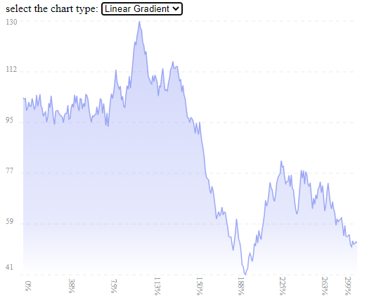
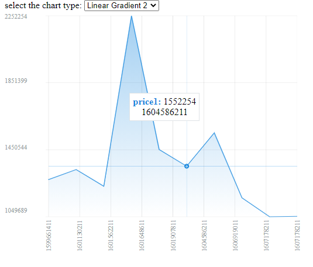
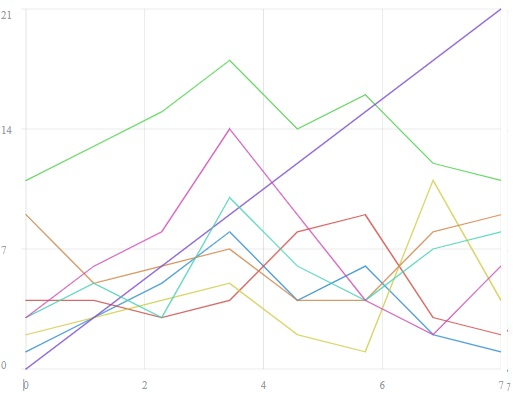

## Info

[](https://www.npmjs.org/package/react-light-chart)
[](https://bundlephobia.com/result?p=react-light-chart)
[](http://npm-stat.com/charts.html?package=react-light-chart)
[](http://npm-stat.com/charts.html?package=react-light-chart)

## Install

To install, use below code

```
npm install react-light-chart
```

Or

```
yarn add react-light-chart
```

## Images

You can clone code and run `npm start` to see below examples in `src/_dev` folder.





## How to Use

```tsx
import {LineChart} from 'react-light-chart';

const style = {width: 500, height: 400};
const data = [11, 12, 5, 3, 6, 9, 8, 7, 5, 2, 1, undefined, 4, undefined, 6, 5, 3, 2, 5]

return <LineChart data={data}
                  style={style}
                  className="foo"/>

```

In this example you see some `undefined`, they are regarded as *weight average* of previous and next values in
the `data`. Also you can use `style` and `className` props just as a simple html element style and className.

#### Multiple lines

You can use `array of objects` as `data`, but you should set `valueSelector` to get value(s) from each object.

```tsx
import {LineChart} from 'react-light-chart';

const style={width: 500, height: 400};
const data = [
    {v1: 1, v2: 4, v3: 11, v4: 2, v5: 9, v6: 0, v7: 3, v8: 3, extraData: 'one'},
    {v1: 3, v2: 4, v3: 13, v4: 3, v5: 5, v6: undefined, v7: 5, v8: 6, extraData: 'two'},
    {v1: 5, v2: 3, v3: 15, v4: 4, v5: 6, v6: undefined, v7: 3, v8: 8, extraData: 'three'},
    {v1: 8, v2: 4, v3: 18, v4: 5, v5: 7, v6: undefined, v7: 10, v8: 14, extraData: 'four'},
    {v1: 4, v2: 8, v3: 14, v4: 2, v5: 4, v6: undefined, v7: 6, v8: 9, extraData: 'five'},
    {v1: 6, v2: 9, v3: 16, v4: 1, v5: 4, v6: undefined, v7: 4, v8: 4, extraData: 'six'},
    {v1: 2, v2: 3, v3: 12, v4: 11, v5: 8, v6: undefined, v7: 7, v8: 2, extraData: 'seven'},
    {v1: 1, v2: 2, v3: 11, v4: 4, v5: 9, v6: 21, v7: 8, v8: 6, extraData: 'eight'}
]

return <LineChart data={data}
                  valueSelector={ e => [e.v1, e.v2]}
                  style={style}/>

```



## Parameters

| Property Name | Type                                                      | Description | Default Value |
| ------------- | --------------------------------------------------------- | ----------- | ------------- |
| data          | `number[]`, `object[]` (array of numbers or objects)      | The data you want to represent | `required` |  
| valueSelector | `string` value for single line chart and `(e:TData)=>number[]` for multiple line chart. `TData` is the type for every object you pass to `data` property | select a property of each object that we passed for `data` property. If you pass `string` value, it should be `keyof` every object | `required` if you set `object[]` for `data` property. |
| indexSelector | 'string' for the field name of every object, or `(e:TData)=>string/number`. `TData` is the type for every object you pass to `data` property | select a property of each that object we passed for `data` property. If you pass `string` value, it should be `keyof` every object | `optional` but you can only use it when `data` is `object[]` (array of objects) |
| labels        | `Labels[]`                                                | changing label color, title, diagram color, etc. | See default value in #Label paragraph. |
| indexAxis     | `IndexesAxisInfo` or `(e:ValuesInfo) => IndexesAxisInfo` | for customizing indexes axis (horizontal) | see #IndexesAxisInfo paragraph for more information. |
| valueAxis     | `ValuesAxisInfo` or `(e:ValuesInfo) => ValuesAxisInfo` | for customizing values axis (vertical) | see #ValuesAxisInfo paragraph for more information. |
| overrideSizes | an object containing of `left`, `bottom`, `right`, `top`, `width`, `height`. all these values are **number**. | Indicates the offsets of chart from 4 sides. | {left: 5, bottom: 8, right: 0, top: 2, width: 100, height: 100,} |
| renderTooltip | **null** or `(e:TooltipRendererParams) => ReactNode` | If you pass null, default tooltip will disappear. If you pass a renderer function, it will be shown for every point hover as a tooltip. | See default value in #Tooltip paragraph. |
| renderSeparatedTooltip | `(e:SeparatedTooltipRendererParams) => ReactNode` | If you pass a renderer function, it will create multiple tooltips for every point hover, and one for each line. If you pass value to this property, `renderTooltip` will be ignored. | **undefined** |


#### Labels

Label type is as follows ↓

```ts
type Label = {
    title?: string; // just to show the name in `default tooltip`.
    stroke?: string; // line color
    area?: LineChartAreaColor; // show gradient color below of the line 
    labelColor?: string; // just to show the color for the name or value in `default tooltip`.
}
```

`LineChartAreaColor` can be `string` for a simple color. Or it can be gradient color, So, for a gradient color you
should pass some parameters as follows ↓

```ts
type LineChartAreaColor = string | {
    rotation?: number; // gradient color rotations.
    grads: {           // array of stop-colors
        stop: string | number; // css units, such as `5px`, `10%`, etc.
        color: string; // color in css.
    }[]
};
```

Default value of `labels` for the chart is :

```ts
['#2384d1', '#d04441', '#46d041', '#d0c941',
    '#d07f41', '#7341d0', '#41d0b3', '#d041b1'].map((r, ix) => ({
    labelColor: r,
    stroke: r,
    title: 'value' + ix
}))
```

#### IndexesAxisInfo

You can use `indexAxis` property to change information shown on index axis (horizontal direction). You can pass an
object of type `IndexesAxisInfo`, or a function that returns an object of type `IndexesAxisInfo`. It is shown in the
following example ↓

```tsx
const indexAxis = {
    linesCount: 10
}
<LineChart data={data}
           style={style}
           indexAxis={indexAxis}/>

// or you can use a function !
function indexAxisFunction(e) {
    return {linesCount: 10}
};
<LineChart data={data}
           style={style}
           indexAxis={indexAxisFunction}/>
```

`IndexesAxisInfo` consist of below properties :

```ts
type IndexesAxisInfo = {
    linesCount?: number | null;             // number of labels shown below and line spearating the chart. 
    linesProps?: SVGProps<SVGLineElement>;  // How do the lines look like?! It's the style of the lines.
    rotation?: number;                      // rotation of labels shown below of diagram.

    renderLabels?: (value: string | number) => React.ReactNode; // If you want to map or show labels of indexes different, you can use this function to change them.
}
```

* `linesCount` is **5** by default.
* `linesProps`, `rotation` and `renderLabels` are **undefind** by default.

If you use a function for `indexAxis`, the single argument of function consist following values ↓

* `minimumValue` is the minimum value computed based on the data and selectors you have passed to the `LineChart`
  component.
* `maximumValue` is the maximum value computed based on the data and selectors you have passed to the `LineChart`
  component.

#### ValuesAxisInfo

You can use `valueAxis` property to change information shown on value axis (horizontal direction). You can pass an
object of type `ValuesAxisInfo`, or a function that returns an object of type `ValuesAxisInfo`. It is shown in the
following example ↓

```tsx
const valueAxis = {
    linesCount: 10,
    minimumValue: 0,
    maximumValue: 100,
}
<LineChart data={data}
           style={style}
           valueAxis={valueAxis}/>

// or you can use a function !
function valueAxisFunction({minimumValue, maximumValue}) {
    return {
        linesCount: 10,
        minimumValue: minimumValue * 0.80,
        maximumValue: maximumValue * 1.2
    }
};
<LineChart data={data}
           style={style}
           valueAxis={indexAxisFunction}/>
```

`ValuesAxisInfo` consist of below properties :

```ts
type ValuesAxisInfo = {
    linesCount?: number | null;             // number of labels shown below and line spearating the chart. 
    linesProps?: SVGProps<SVGLineElement>;  // How do the lines look like?! It's the style of the lines.
    rotation?: number;                      // rotation of labels shown below of diagram.

    minimumValue?: number;                  // the minimum value on the chart, used when you want to scale the chart.
    maximumValue?: number;                  // the maximum value on the chart, used when you want to scale the chart.
    renderLabels?: (value: number) => React.ReactNode; // If you want to map or show labels of indexes different, you can use this function to change them.
}
```

* `linesCount` is **4** by default.
* `minimumValue` and `maximumValue` are computed by the data passed to the `LineChart` component.
* `linesProps`, `rotation` and `renderLabels` are **undefind** by default.

If you use a function for `valueAxis`, the single argument of function consist following values ↓

* `minimumValue` is the minimum value computed based on the data and selectors you have passed to the `LineChart`
  component.
* `maximumValue` is the maximum value computed based on the data and selectors you have passed to the `LineChart`
  component.

#### Tooltip

You can pass **null** value for `renderTooltip` prop to prevent rendering of default tooltip. Or you can pass a renderer
function for showing customized tooltip as shown in following example :

```tsx
<LineChart data={data}
           style={style}
           className="foo"
           renderTooltip={e => {
               const c = e.data || e.prevDefinedData!;
               return <span style={e.pointPosition}>
                   <div>{e.index}: {c}</div>
               </span>
           }}/>
```

Remember, you should add style of returning node, unless the tooltip does not work well.

Here, `renderTooltip` is a function with one argument of type `TooltipRendererParams` that contains below properties:

```ts
type PointParameters = {
    data: object;             // data of current hovered point
    prevDefinedData: object;  // data of previous defined point, used when `data` is undefined.
    nextDefinedData: object;  // data of next defined point, used when `data` is undefined.
    index: string | number;   // index of current hovered point
    values: (number | undefined)[]; // values of current hovered point. It's array because we may have multiple lines, so we have multiple value at the same hovering point.
    arrayIndex: number;       // index of current hovered point in array of data passed to LineChart component
    pointPosition: { position: 'absolute', left: string, top: string, zIndex:number }; // position of the point on chart. `top` and `left` are calculated by percent.
    props: LineChartProps;    // props passed to LineChart component.
    labels: Label[];          // labels passed to LineChart component, or default value of labels if no label passed to the component.

    defaultCssProps: React.CSSProperties; // css properties of default tooltip.
}
```

#### SeparatedTooltip

You can pass `renderSeparatedTooltip` prop to show multiple tooltips for each line at the same point.
`renderSeparatedTooltip` is a function for as shown in following example :

```tsx
<LineChart data={data}
           style={style}
           className="foo"
           renderSeparatedTooltip={e => {
               return <span style={{...e.pointPosition, color: e.labels[e.valueIndex].labelColor}}>
                   {e.index} : {e.value}
               </span>
           }}/>
```

This function will be run multiple time for each value on the same index (hovering points).

Remember, you should add style of returning node, unless the tooltip does not work well.

Here, `renderSeparatedTooltip` is a function with one argument of type `TooltipRendererParams` that contains below
properties:

```ts
type SeparatedTooltipRendererParams = {
    data: object;             // data of current hovered point
    prevDefinedData: object;  // data of previous defined point, used when `data` is undefined.
    nextDefinedData: object;  // data of next defined point, used when `data` is undefined.
    index: string | number;   // index of current hovered point
    values: (number | undefined)[]; // values of current hovered point. It's array because we may have multiple lines, so we have multiple value at the same hovering point.
    arrayIndex: number;       // index of current hovered point in array of data passed to LineChart component
    pointPosition: { position: 'absolute', left: string, top: string, zIndex:number }; // position of the point on chart. `top` and `left` are calculated by percent.
    props: LineChartProps;    // props passed to LineChart component.
    labels: Label[];          // labels passed to LineChart component, or default value of labels if no label passed to the component.

    lineIndex: number;        // index of the line containing the rendering point.
    value: number | undefined; // value of the rendering point.
}
```


# Contribution
You can report me bugs in GitHub. 🙏
Also, I would be glad if you give me star in github. 😊
